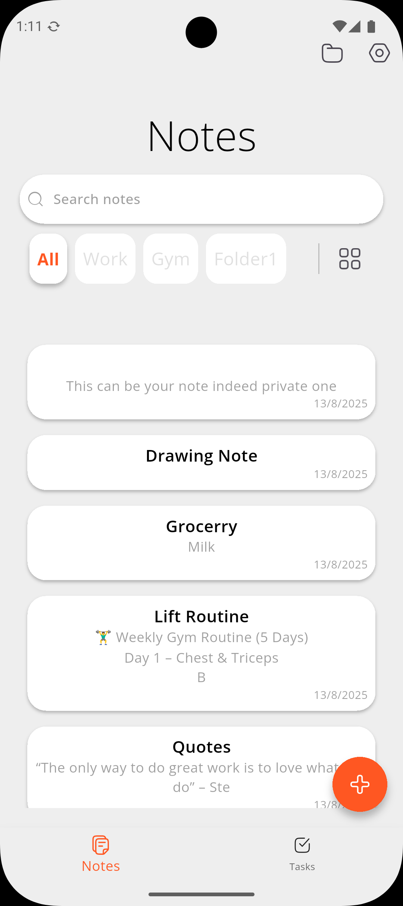
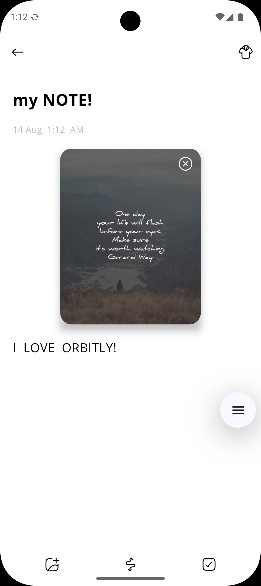
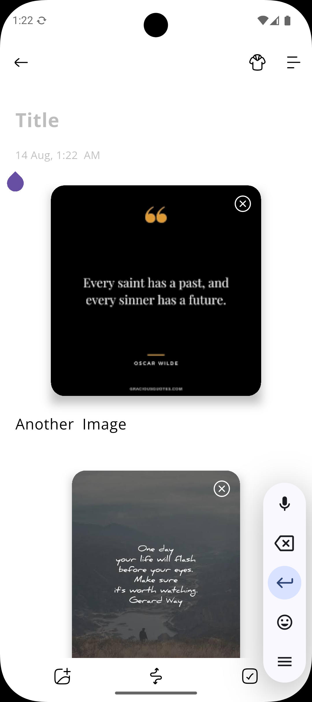
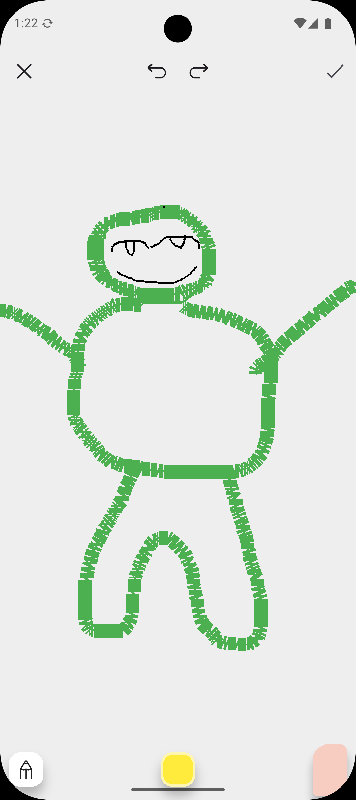
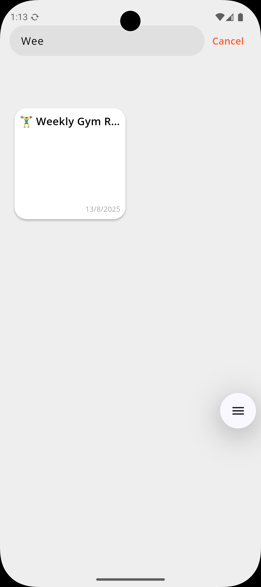
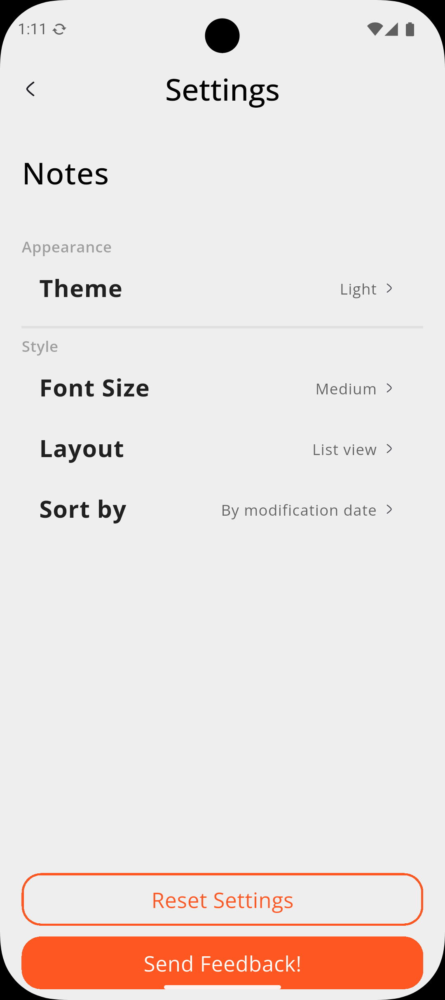
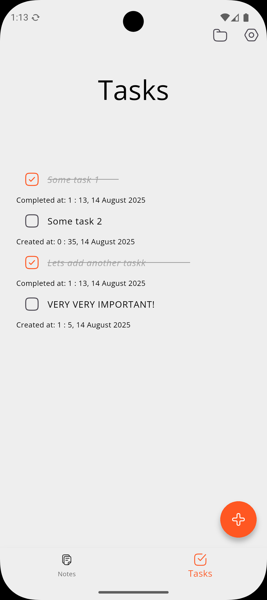

<p align="center">
  
</p>

<h1 align="center">🚀 Orbitly</h1>
<p align="center"><b>Your all-in-one productivity app for notes, tasks, and more!</b></p>

<p align="center">
  <a href="https://flutter.dev/"></a>
  <a href="LICENSE"></a>
  <a href="#"></a>
  <a href="apk/app-x86-release.apk"></a>
</p>

---

## ✨ Features

- 📝 **Notes**
  - Create, edit, and delete notes
  - Attach personal pictures to notes
  - Add checklists inside notes
  - ✏️ Draw on the screen and save sketches to notes

- ✅ **Tasks**
  - Add, edit, and manage custom tasks

- 🎨 **Settings**
  - Choose your preferred theme (🌞 Light / 🌙 Dark)
  - Select font size and layout
  - Sort notes by modification date or oldest first
  - Persistent settings saved across sessions

- 🔮 **Planned Features**
  - 💸 Expense tracker
  - 📅 Planner/calendar integration

---

## 🛠️ Technologies Used

| Technology      | Purpose                |
|-----------------|-----------------------|
| **Flutter**     | Cross-platform UI     |
| **Provider**    | State management      |
| **GoRouter**    | Navigation            |
| **Sqflite**     | Local database        |
| **Path Provider** | File storage        |
| **Custom Widgets** | UI components      |

---

## 🚀 Getting Started

```sh
git clone https://github.com/yourusername/orbitly.git
cd orbitly
flutter pub get
flutter run
```

---

## 📁 Folder Structure

```
lib/
 ├─ pages/       # App screens (notes, tasks, settings, etc.)
 ├─ providers/   # State management
 ├─ widgets/     # Reusable UI components
 └─ core/        # Constants, styles, helpers
```

## 📷 Screenshots

Here are some screenshots showing Orbitly in action:

<p align="center">
  
  
  
  
  
  
  
</p>
---

<div align="center">

<h3>🙌 Support</h3>

<p>If you like <b>Orbitly</b>, consider giving it a ⭐ on GitHub — it helps others discover the project and keeps me motivated!</p>


</div>

---
